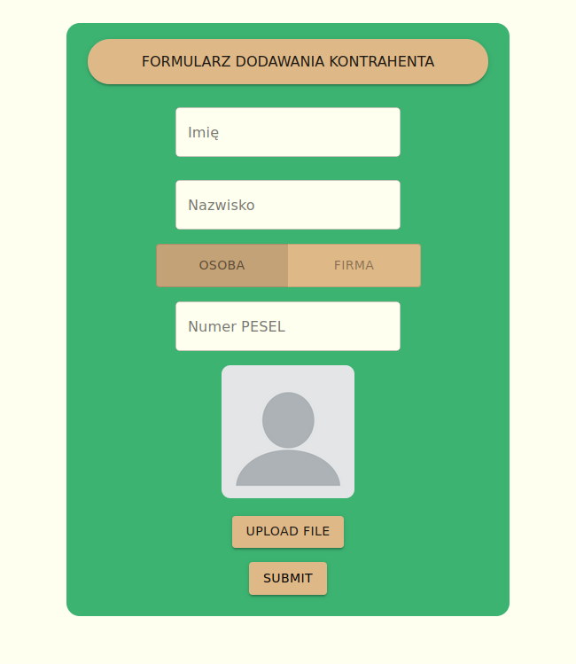

# ValidationForm

Validation form app is a basic form where a user can write his personal data and upload a photo.
It is using the POST fetch method but is not meant to connect with the server so it throws an error every time.

You can find it here:
https://werthis.github.io/ValidationForm/

## `react`, `material-ui`